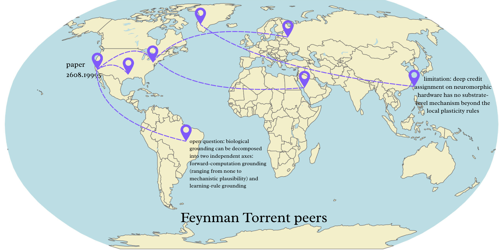

# feynman's prism

A distributed network of Feynmans churning on open research problems from
[Emergent Mind](https://www.emergentmind.com). Each *pear* is a peer in a
room that joins problems, chats, and (later) gets assigned fragments of the
research tree. Pears find each other over loopback and over a
[Tailscale](https://tailscale.com) tailnet (WireGuard). Looks like WebTorrent
but instead of movies there are open problems.



## torrent in 30 seconds

Needs Node.js ≥ 22.22, [pnpm](https://pnpm.io) and, for rooms of many pears, `brew install tmux`.

```bash
pnpm -C torrent install
pnpm -C torrent pear             # you are in room "pears" as, say, Eridanus. first pear in = coordinator
```

Open a second terminal and run the last line again with `--home <dir>`: the
header flips to `online · 1 peers` and the new pear shows up under its own
name. Keys: `j`/`k` move · `space` join/leave a problem · `enter` expand ·
`m` message · `q` quit.

The first run writes your identity to `~/.feynman/identity.json`: a keypair and
a device name drawn at random from the DESIGN.md list (Nonacris, Eridanus,
Corinth…). A second pear on the same machine needs its own with `--home <dir>`.

## joining from a link

Someone on the network sends you an invite code; on any laptop:

```bash
curl -fsSL https://adiabatic.garden/join | sh -s -- feynman:adiabatic.garden:<inviter>:<key>
```

That installs Tailscale if needed, clones this repo into `~/.feynman/prism`,
logs the machine into the feynman tailnet with the invite's single-use key,
asks for a username, records who invited you, and starts the pear. On a
checkout you already have, `pnpm -C torrent join -- --invite <code>` does the
same from step two. Without an invite, `pnpm -C torrent join` just sets the
username and launches; pears then only meet over loopback or a tailnet you are
already on.

To invite someone, put `HEADSCALE_URL` and `HEADSCALE_API_KEY` in
`torrent/.env.local` (see hosting below) and run
`pnpm -C torrent invite -- --user <their name>`; without `--user` the key is
for another device of your own. If `tailscale` is
running, pears on every online device of your tailnet see each other too;
`--local` keeps a pear on loopback.

```bash
pnpm -C torrent orchestrator -- 5        # a whole room at once, tiled in tmux
pnpm -C torrent orchestrator -- stop
```

Start DeepSeek pears with one command from the repo root (requires `just` and `tmux`):

```bash
just pears 3 lab          # start or reopen 3 pears in room lab
just pears-attach lab     # reconnect
just pears-restart 5 lab  # restart with 5 pears; clears conversation histories
just pears-stop lab      # stop the room
```

`just pears` defaults to 3 pears in `manual-pears`. Click a pane, type its problem,
and press Enter; subsequent lines are follow-ups. Ctrl+B then D leaves the room
running. Larger groups use up to four panes per tmux window; click the window
name in the bottom bar to switch. Pears wait for manual assignments and ignore
room chat. Set `OPENROUTER_API_KEY` in `torrent/.env.local` or use your saved
opencode login. `PEAR_MODEL` optionally selects another `deepseek/` model.

## all commands

Run from the repo root. Room commands take `--room <name>` to select a room.

| Command | What it does |
| --- | --- |
| `pnpm -C torrent pear -- [--room r] [--name n \| --index i] [--auto-join id] [--coordinator] [--local] [--home dir]` | one pear (Ink TUI; headless when stdin is not a TTY) |
| `pnpm -C torrent orchestrator -- [N=5] [--room r] [--join] [--terminal]` | start N pears in a tmux session (`--terminal`: macOS Terminal windows); pear #i keeps its identity in `torrent/.pears/<room>/<i>` |
| `pnpm -C torrent orchestrator -- stop [--room r]` | kill the tmux session; every pear closes its sockets |
| `pnpm -C torrent join -- [--invite code] [--home dir] [--room r] [--no-launch]` | one-time setup: tailnet login with the invite, username, then the pear |
| `pnpm -C torrent invite -- [--user name] [--hours 24]` | mint an invite code (single-use Headscale pre-auth key); needs `HEADSCALE_URL`/`HEADSCALE_API_KEY` |
| `pnpm -C torrent message -- "hi" [--room r] [--as name] [--listen 12]` | one-shot message, listen for replies, exit |
| `pnpm -C torrent transcript -- [--room r] [--every 30]` | record chat to `torrent/snapshots/<room>-<time>.md`; stdin lines are sent as `[scribe]` |
| `pnpm -C torrent agent -- <persona> [--room r]` | LLM persona pear; persona ids are the keys of the JSON block in `PEARS.md`. Needs `OPENROUTER_API_KEY` (or an opencode login); `PEAR_MODEL` overrides the model |
| `pnpm -C torrent discord` | Discord program chair with direct persona conversations and bounded delegation; setup below. Still on Hyperswarm, so it does not see pear rooms until it is ported |
| `pnpm -C torrent discord:costs [YYYY-MM-DD]` | reported OpenRouter usage and costs for a UTC day; defaults to today |
| `pnpm -C torrent room` / `node torrent/scripts/guillefix.cjs <room>` | the original Hyperswarm stdin chat client (legacy; not in pear rooms any more) |
| `pnpm -C torrent fragment-submit -- <problemId> <subproblemId> "<content>" [--spawns "q \|\| q"] [--room r]` | solve a subproblem; `--spawns` lists the subproblems it uncovered, which the coordinator adds under the solved node |
| `pnpm -C torrent fragment-velocity -- <fragmentId> <factor> [--room r]` | report downstream speedup; the roads into that node are reinforced (or dropped when the factor stays below 1) |
| `pnpm -C torrent propose -- <problemId> "<text>" [--parent q3] [--room r]` | propose a subproblem; it waits in the coordinator's review queue |
| `pnpm -C torrent review -- [--approve all\|1,2] [--reject 3] [--room r]` | list the queue, or settle a batch of it |
| `pnpm -C torrent check` | `lint` (oxlint + prettier) · `typecheck` · `test` |
| `pnpm -C site dev` · `pnpm -C site build` · `pnpm -C site lint` | Changing Shores, the low-poly Three.js game and visuals site ([site/README.md](site/README.md)) |
| `uv sync` | Python deps for `graphs/` and `tools/` |
| `uv run helm-mirror run` | evaluate feynman research runs, HELM-style ([design](tools/helm_mirror/design.md)) |
| `just ingest` | gate: paper dumps → postgres `papers` table (needs `DATABASE_URL`) |
| `just policy "focused ultrasound"` | rwx-policy: probability distribution over papers + rwx decimals |
| `just run "focused ultrasound"` | ingest, then policy |
| `just test` · `just lint` | Python unittest · ruff |
| `node tools/research/cli.mjs --help` | one-question SQLite research tree ([docs](tools/research/README.md)) |
| `node tools/research/cli.mjs tree --db tools/outputs/credit-assignment-passages.sqlite` | inspect the completed credit-assignment tree |

Postgres for the gate: `export DATABASE_URL="postgresql://postgres@localhost:5432/propagate"`
(a local brew postgres with trust auth works).

## Discord program chair

The application being onboarded is recorded in [discord.md](discord.md). The
runtime uses the authenticated bot's Discord ID, so changing its display name
does not require changing the router. Its research role is the program chair.

1. Copy `torrent/.env.example` to `torrent/.env.local`, which is ignored by git.
   Set `DISCORD_BOT_TOKEN` from the application's **Bot** page,
   `OPENROUTER_API_KEY`, `PEAR_MODEL` to an available OpenRouter model ID, and
   `DISCORD_CHANNEL_ID` to a server text channel's ID. Discord Developer Mode
   exposes **Copy Channel ID**. An application ID is not a channel ID or token.
2. Give the bot **View Channel**, **Send Messages**, **Read Message History**,
   **Create Public Threads**, and **Send Messages in Threads** in that channel.
   Startup checks the effective permissions, including channel overrides.
3. Run one instance from the repository root:

   ```bash
   pnpm -C torrent discord
   ```

Select the bot's actual mention in Discord, then type a request:

```text
@your-bot investigate the credit assignment problem
@your-bot aman: propose a formal model
@your-bot gwern: critique Aman's assumptions
@your-bot chair: compare the two approaches
@your-bot status
@your-bot stop
```

New requests in the configured channel create a thread. Continue in that thread
to share its context; unrelated threads have separate histories. Follow-ups use
the last addressed persona; `chair:` switches back to orchestration (`noera:`
is also an alias). `representer:` and `compressor:` are available directly.
The bot posts labeled persona replies through a single Discord account.

By default every request needs a bot mention. For plain follow-ups such as
`aman: explain that bound` in existing bot threads, enable **Message Content
Intent** in the Discord Developer Portal and set `DISCORD_MESSAGE_CONTENT=1`.
See [Discord Gateway intents](https://docs.discord.com/developers/events/gateway).
The bot ignores other channels, bots, and webhook messages. Optional
`DISCORD_USER_IDS` restricts callers to comma-separated user IDs; otherwise
everyone who can participate in the configured channel can submit requests.

The chair creates a validated plan for Aman and Gwern, runs those two workers
concurrently, optionally calls Representer, and synthesizes one round. Each run
allows at most five model calls, each with a 1,200-token output limit and a
120-second request timeout. Input is bounded to 32,000 characters per call;
the output limit is not a total-token or dollar spending cap. Two conversations
can run at once, with one active run per thread. Busy requests receive a retry
message. `status` reports progress; the initiating user can `stop` a run or
`resume` its last request as a new run. Resuming can incur new charges.

Edit [PEARS.md](PEARS.md) to change personas, then restart. It is the shared
source for Discord and the Hyperswarm agent; the former `personas.json` has
been migrated there. The Discord workers are model conversations in one local
process. They do not yet browse papers, execute experiments, or dispatch to
remote Hyperswarm peers. Treat generated references as unverified.

Events and [OpenRouter-reported usage](https://openrouter.ai/docs/cookbook/administration/usage-accounting)
are appended under `torrent/snapshots/discord/`, with UTC daily ledgers and
conversation checkpoints every 30 seconds and at state changes. The logger
does not call a model automatically. Restarted active runs are marked interrupted;
send `resume` in their thread to start them again with saved context. Costs
missing from provider responses remain unknown. Cancellation stops local work,
but provider charges for interrupted requests may not appear in the ledger.
Use Ctrl-C to stop the process. Local transcript files are ignored by git.

Verification: `pnpm -C torrent check`. Live smoke: start the bot, mention it with
`aman: say hello`, check the new thread, then try a chair request, `status`, and
`stop`. Run `pnpm -C torrent discord:costs` to inspect reported usage.

## how the torrent works

There is no server and no DHT. Every pear listens on the first free port of
`7100–7109` and, on a backing-off schedule, dials every port of every host it
can see: loopback always, plus every online device of the tailnet when
`tailscale` is running (`tailscale status --json` is the tracker). The first
line on a connection is an id handshake carrying the pear's public key, its
room and its port; a pear in another room is dropped, and when two pears dial
each other both keep the connection the lower key opened. Inbound connections
are only accepted from loopback and Tailscale's own address ranges.

**Identity.** `~/.feynman/identity.json` holds an ed25519 seed and the device
name, both created on the first run (`--home` or `FEYNMAN_HOME` picks another
directory). The public key is the pear's id on the wire and will sign
contribution receipts. A corrupt file is refused rather than replaced.

**Naming.** Every pear names itself: the device name in its identity file,
drawn at random from DESIGN.md's list on the first run. When two pears meet
wearing the same name, the one that joined the room later re-rolls and saves
the new name; `--name`/`--index` pin a name that is never yielded. Names are
for humans — the wire identifies pears by public key.

**Coordinator.** One pear per room coordinates (it will own review routing and
assignment). It is the pear that has been in the room longest, ties broken by
key; every pear computes the same answer from the hellos it has seen, so there
is no election traffic. A pear that starts into an empty room coordinates
immediately; if the coordinator quits, the next most senior pear takes over.
The header shows who is coordinating.

**Messages.** Press `m`, type, `enter`. Messages go to every connected peer as a
plain line `[name] text` — the same format the upstream
[pear-to-pear](https://github.com/exanova-y/pear-to-pear) tools use, so a pear,
`message`, `transcript` and the LLM agents all share one room.
The pear's own control protocol (hellos, joins, renames) travels on the
same sockets as JSON lines prefixed with `U+001F`; every client skips those, so
humans only see chat.

**Orchestrator.** Pear #0 gets `--coordinator` so the room has one from t=0;
each pear keeps its own identity (and so its name) in `torrent/.pears/<room>/<i>`.
`--join` gives each pear a different problem. `stop` kills the tmux session,
which SIGHUPs every pear so it closes its sockets cleanly. Without tmux (or
with `--terminal`) it opens one macOS Terminal window per pear instead; quit
those with `q`.

**Problem graph.** The coordinator keeps every problem's subproblems, the
dependencies between them and the proposal queue in `<home>/graph.sqlite`
(`node:sqlite`, no native module) and broadcasts a snapshot of the problem
after each change; other pears render that snapshot, and a pear that takes
over as coordinator absorbs the last snapshot it saw before writing. The graph
is seeded once from `torrent/src/data.ts` (`q1…qN` per problem) and then grows
on its own. A submitted fragment marks its node solved, adds each `--spawns`
subproblem as a child that required it, and logs which open nodes it
unlocked. A velocity report multiplies the weight of every road into that
node by the factor; a road that decays below 0.05 is dropped, since a
dependency that never sped anything up was not one. Those two changes need no
one's approval. Human proposals (`p` in the TUI, `pnpm propose`) queue up
instead and are settled in batches (`r` as coordinator, `pnpm review`).
Expanding a problem shows the tree: `✓` solved, `○` ready, `·` blocked on an
open requirement.

**Personas** are the JSON block in [PEARS.md](PEARS.md) (read at startup by the
LLM agents). The `stirrer` walks the problem list in `torrent/src/data.ts`, the
single source of truth for names and problems.

### hosting adiabatic.garden

The tailnet's control plane is [Headscale](https://github.com/juanfont/headscale)
behind Caddy, defined in `infra/headscale/` (Caddy also serves `/join`).
On a small VPS with ports 80 and 443 open and DNS for `adiabatic.garden`
pointing at it:

```bash
scp -r infra/headscale you@vps:feynman && ssh you@vps
cd feynman && docker compose up -d
docker compose exec headscale headscale users create <you>
docker compose exec headscale headscale apikeys create --expiration 90d   # → HEADSCALE_API_KEY
```

Back on your machine, set `HEADSCALE_URL=https://adiabatic.garden` and the API
key in `torrent/.env.local`, then `pnpm -C torrent invite -- --user <you>` and
run the printed `curl … | sh -s -- <code>` line on each of your devices. Every
device on the tailnet is visible to every pear; there is no other server. To
use another domain, change it in `Caddyfile`, `config.yaml` (`server_url`,
`dns.base_domain`) and `site/join.sh`.

### troubleshooting

- **`connecting` for a long time.** Loopback pears connect within a second;
  tailnet pears within one sweep (3 s, then backing off to 60 s). Check
  `tailscale status` shows the other device online, and that both pears use
  the same `--room`.
- **Two pears on one machine share a name or fight.** They share
  `~/.feynman/identity.json`; give the second one `--home <dir>`.
- **`EADDRINUSE`.** All ten ports `7100–7109` are taken: `pgrep -fl pear.tsx`
  finds leftover pears. Pears close their sockets on `q`, Ctrl-C, SIGTERM and
  SIGHUP, so this should only happen after a hard kill.
- **Two coordinators.** Two pears that both started into an apparently empty
  room self-elect; on meeting, the earlier start wins, the other gives up its
  name and asks the winner for one. Harmless.

## repo map

```
README.md  AGENT.md  DESIGN.md  CONTEXT.md  CHANGELOG.md  PEARS.md
torrent/        the pear: p2p client over loopback / tailscale (TypeScript, Ink)
  src/          wire · identity · invite · headscale · transport · room · state · send · presence · naming · peer · lifecycle · ui/ · pear.tsx (entry) · discord/ (wip, hyperswarm)
  scripts/      join · invite · orchestrator · message · transcript · agent · guillefix.cjs
infra/headscale/  adiabatic.garden: Headscale + Caddy compose, config, and the /join script
site/           Changing Shores: Vite + React shell, src/game/ Three.js engine (visual-design.md)
  tests/        node:test over the pure modules (wire, room, naming)
autoresearch/   vendored feynman autoresearch
tools/          helm_mirror (evaluator) · research (SQLite research tree) · instructions · outputs/ (untracked)
graphs/         corpus/ (paper dumps, open problems) · corpus_ingest/ (gate, rwx policy)
tests/          Python + node tests for graphs and tools
docs/           in-short.md (the proposal), images
```

Style and limits for contributors and agents: [AGENT.md](AGENT.md). Design
notes: [DESIGN.md](DESIGN.md). History and scrap notes: [CONTEXT.md](CONTEXT.md).
Acoustics (CT viewer, jwave simulation) moved to
[exanova-y/propagate-yourself](https://github.com/exanova-y/propagate-yourself).
